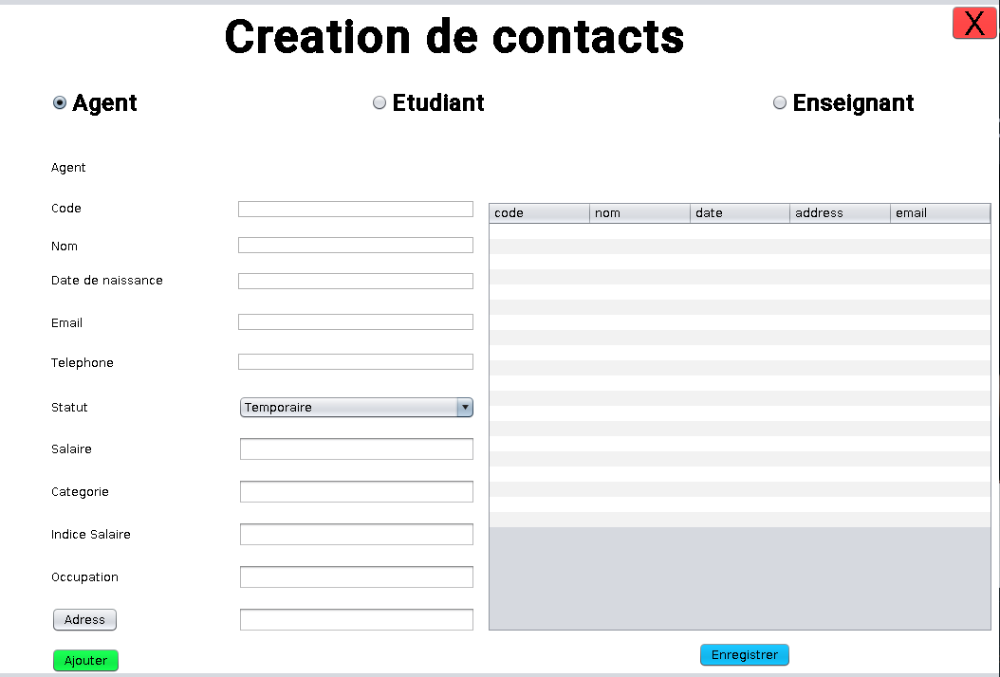
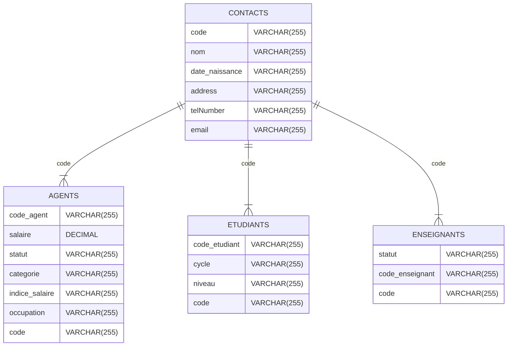

# Projet Gestion Des Contacts

## Fenetre  :
### Enregistrer un contact

### Liste des contacts


 <h1><center>Shema de la BD</center></h1>


## Comment Lancer le projet
1) Clonner le Projet

2) Sur la racine du projet excecuter la commande
```bash
     java MainFrmApplication
```
