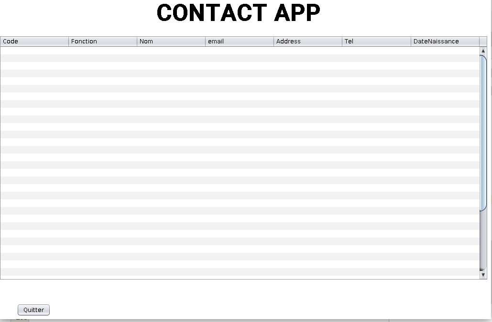
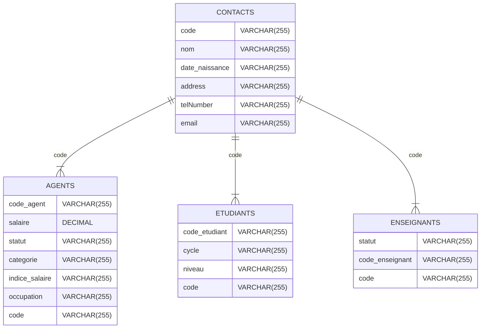
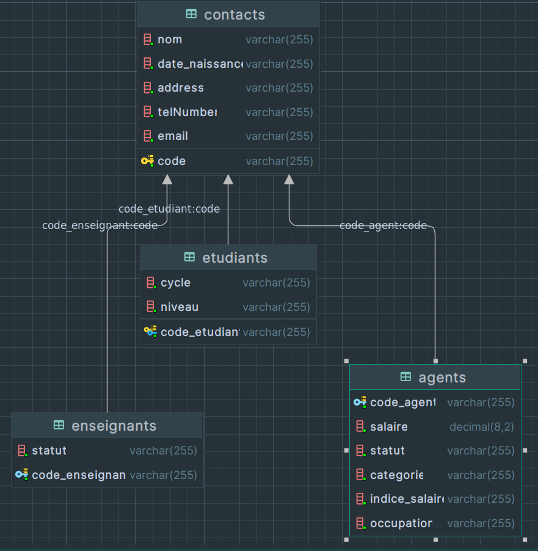

# Projet Gestion Des Contacts

## Fenetre  :
### Enregistrer un contact

### Liste des contacts


 <h1><center>Shema de la BD</center></h1>




## Comment Lancer le projet
1) Clonner le Projet : 
- Deux options pour compiler 👍
#### Avec NetBean, Eclipse 
 Ouvrez le projet avec NetBeans ou Eclipse et Lancer le projet.
#### Le faire directement
```bash
     git clone https://github.com/Nameless0l/Contact_Record.git ProjetContactRecordMbassiLoicAron
```
```bash
     cd ProjetContactRecordMbassiLoicAron
```
```bash
     cd contact_record
```
```bash
    java MainApplication
```

## Structure du projet : dossier et fichiers et importants
```
📁 ProjetContactRecordMbassiLoicAron/
                                    │
                                    |
                                    ├──📄 README.md
                                    └── 📁 src/
                                        │
                                        ├── 📁 contact_record/
                                        │   ├──📄 Contact.java
                                        │   └──📄 MainApplication.java 
                                        ├── 📁 core/
                                        │   ├──📄 Agent.java
                                        │   ├──📄 Contact.java
                                        │   ├──📄 Enseignant.java
                                        │   ├──📄 Etudiant.java
                                        │   └──📄 Repertoire.java 
                                        |
                                        └── 📁 ihm/
                                            ├──📄 ContactRecord.java
                                            ├──📄 MainFrApplication.java
                                            └──📄 ContactDisplay.java 


```
